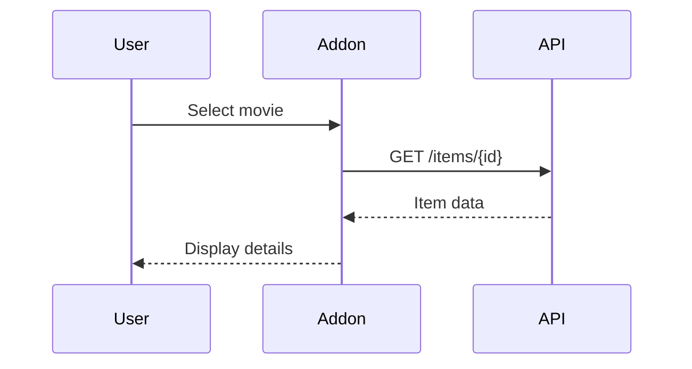

# Documentation Directory

This directory contains technical documentation generated through reverse engineering and analysis of the kodi.kino.pub addon.

## Purpose

This documentation serves as the foundation for understanding the existing addon architecture and will guide the clean rewrite effort. All documentation here is based on factual analysis of the current codebase.

## Documentation Structure

### Reverse Engineering Documentation

Documentation created through reverse engineering tasks (see `.github/epics/001-full-reverse-engineering.md`):

#### Architecture & Design
- **architecture.md** - Core modules, dependencies, and class hierarchies
- **data_flow.md** - Data flow patterns and state management
- **menu_structure.md** - UI navigation and menu hierarchy
- **new_architecture.md** - Proposed clean architecture for rewrite

#### API & Network
- **api_endpoints.md** - Complete kino.pub API endpoint inventory
- **api_data_models.md** - API request/response models and schemas
- **api_contract.md** - Full API specification with examples
- **authentication.md** - OAuth flow and token management
- **error_handling.md** - Network error scenarios and handling

#### Routing & Navigation
- **routes.md** - All addon routes, patterns, and parameters
- **menu_structure.md** - Navigation paths and UI structure

#### Playback
- **video_url_resolution.md** - Quality selection and URL resolution
- **inputstream_integration.md** - InputStream Adaptive integration
- **playback_state.md** - Resume points and watch status
- **playback_flow.md** - Complete playback sequence
- **tvshow_handling.md** - TV show, season, and episode structure

#### Runtime Behavior
- **logging_samples.md** - Debug logs from real usage
- **events_funnel.md** - User workflow event sequences
- **error_scenarios.md** - Error conditions and edge cases

## Documentation Guidelines

### Factual Basis
- All documentation must be based on actual code, logs, or observed behavior
- Do not speculate or assume - mark unknowns clearly with "❓"
- Include code references (file:line) for claims

### Format
- Use Markdown for all documentation
- Include code snippets with syntax highlighting
- Use diagrams where helpful (Mermaid preferred)
- Keep tables for structured data

### Code References
When documenting code behavior, reference the source:
```
Example: `src/resources/lib/main.py:84-87`
```

### Sequence Diagrams
Use Mermaid for sequence diagrams:


### API Documentation
For API endpoints, use this format:
```markdown
### GET /items/{id}

**Purpose**: Retrieve item details

**Parameters**:
- `id` (path, required): Item identifier

**Response**:
```json
{
  "status": 200,
  "item": { ... }
}
```
```

## Maintenance

- Update documentation when code changes
- Mark deprecated endpoints/routes
- Keep examples up to date
- Review quarterly for accuracy

## Contributing

When adding or updating documentation:

1. Verify facts against current code
2. Include code references
3. Use consistent formatting
4. Add examples where helpful
5. Update this README if adding new doc types

## Related

- Epic planning: `.github/epics/`
- Source code: `src/`
- Tests: `tests/`
