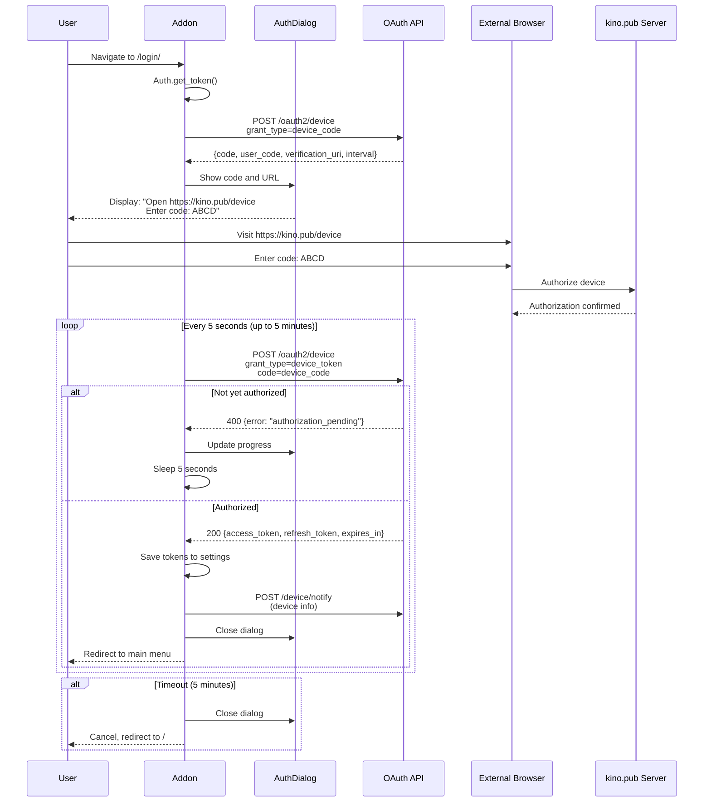

# Authentication and Token Management

Complete OAuth device code flow and token lifecycle documentation for the kodi.kino.pub addon.

## Overview

The addon uses **OAuth 2.0 Device Authorization Grant** (RFC 8628) for authentication.

**Authentication Type:** OAuth 2.0 Device Code Flow  
**Client Credentials:** Static (embedded in code)  
**Token Storage:** Kodi addon settings (persistent)  
**Token Refresh:** Automatic on expiry or 401 error

---

## OAuth Client Credentials

**Location:** `auth.py:76-77`

```python
class Auth:
    CLIENT_ID = "xbmc"
    CLIENT_SECRET = "cgg3gtifu46urtfp2zp1nqtba0k2ezxh"
```

**Security Note:** Credentials are hardcoded in source (typical for native apps using device flow)

---

## OAuth URLs

**OAuth Endpoint:** Configured in settings

```python
# In settings.py:63-65
@property
def oauth_api_url(self) -> str:
    return "https://api.service.kino.pub/oauth2/device"
```

**Endpoints Used:**
- Device Code Request: `POST /oauth2/device`
- Device Token Exchange: `POST /oauth2/device` (with different grant_type)
- Token Refresh: `POST /oauth2/device` (with refresh_token grant)

---

## OAuth Device Code Flow

### Complete Flow Sequence



### Step-by-Step Flow

#### Step 1: User Initiates Login

**Trigger:** User navigates to `/login/` route

**Code:** `main.py:84-86`

```python
@plugin.routing.route("/login/")
def login() -> None:
    plugin.auth.get_token()
```

#### Step 2: Determine Auth State

**Code:** `auth.py:226-230`

```python
def get_token(self) -> None:
    if not self.plugin.settings.access_token:
        self._activate()  # No token → Device flow
    else:
        self._refresh_token()  # Has token → Refresh
```

#### Step 3: Request Device Code

**Method:** `Auth._get_device_code()`  
**Location:** `auth.py:131-143`

**Request:**
```http
POST /oauth2/device HTTP/1.1
Content-Type: application/x-www-form-urlencoded

grant_type=device_code&client_id=xbmc&client_secret=cgg3gtifu46urtfp2zp1nqtba0k2ezxh
```

**Response:**
```json
{
  "status": 200,
  "code": "<device_code>",
  "user_code": "ABCD12",
  "verification_uri": "https://kino.pub/device",
  "interval": 5,
  "expires_in": 300
}
```

**Extracted Data:**
- `device_code` - Server-side identifier for this auth attempt
- `user_code` - Short code user enters (4-6 chars)
- `verification_uri` - URL user visits
- `interval` - Polling interval in seconds (typically 5)

#### Step 4: Display Authorization UI

**Method:** `Auth._activate()`  
**Location:** `auth.py:213-220`

**Implementation:**
```python
def _activate(self) -> None:
    resp = self._get_device_code()
    self._auth_dialog.show(
        f"{localize(32004)} [B]{resp['verification_uri']}[/B]\n"
        f"{localize(32005)}: [B]{resp['user_code']}[/B]",
    )
    self._verify_device_code(resp['refresh_interval'], resp['device_code'])
```

**UI Display:**
```
┌────────────────────────────────────┐
│      Device activation             │
├────────────────────────────────────┤
│ Open https://kino.pub/device       │
│ and enter the code: ABCD12         │
│                                    │
│ [Progress bar: ████░░░░░░ 40%]    │
│                                    │
│            [Cancel]                 │
└────────────────────────────────────┘
```

**Localized Strings:**
- 32001: "Device activation" (dialog title)
- 32004: "Open" (instruction)
- 32005: "and enter the code" (instruction)

#### Step 5: Poll for Authorization

**Method:** `Auth._verify_device_code()`  
**Location:** `auth.py:184-202`

**Polling Configuration:**
```python
steps = (5 * 60) // interval  # 5 minutes total
# With interval=5: steps = 60 (60 attempts)
```

**Polling Loop:**
```python
for i in range(steps):
    if self._auth_dialog.iscanceled:
        # User clicked cancel
        self._auth_dialog.close(cancel=True)
        break
    else:
        try:
            self._get_device_token(device_code)
        except AuthPendingException:
            # Not yet authorized, continue polling
            self._auth_dialog.update(i)
            xbmc.sleep(interval * 1000)  # Sleep in milliseconds
        else:
            # Success! Tokens received
            self._update_device_info()
            self._auth_dialog.close()
            break
else:
    # Timeout after 5 minutes
    self._auth_dialog.close(cancel=True)
```

**Request per Poll:**
```http
POST /oauth2/device HTTP/1.1
Content-Type: application/x-www-form-urlencoded

grant_type=device_token&client_id=xbmc&code=<device_code>&client_secret=cgg3gtifu46urtfp2zp1nqtba0k2ezxh
```

**Responses:**

**Pending (400):**
```json
{
  "error": "authorization_pending",
  "error_description": "User has not yet authorized"
}
```
→ Raises `AuthPendingException`, continue polling

**Success (200):**
```json
{
  "status": 200,
  "access_token": "eyJ...",
  "refresh_token": "def...",
  "expires_in": 3600,
  "token_type": "bearer"
}
```
→ Save tokens, exit loop

**Expired (400):**
```json
{
  "error": "code_expired",
  "error_description": "Device code expired"
}
```
→ Raises `AuthExpiredException`, abort flow

#### Step 6: Save Tokens

**Method:** `Auth._update_settings()`  
**Location:** `auth.py:204-211`

```python
def _update_settings(self, refresh_token: str, access_token: str, expires_in: int) -> None:
    self.plugin.settings.refresh_token = refresh_token
    self.plugin.settings.access_token = access_token
    self.plugin.settings.access_token_expire = str(expires_in + int(time.time()))
    self.plugin.logger.debug(
        f"Refresh token - {refresh_token}; access token - {access_token}; "
        f"expires in - {expires_in}"
    )
```

**Token Storage:**
- `refresh_token` - Stored in addon settings
- `access_token` - Stored in addon settings  
- `access_token_expire` - Calculated: `current_timestamp + expires_in`

**Settings Location:** xbmcaddon.Addon settings (persistent across sessions)

#### Step 7: Register Device

**Method:** `Auth._update_device_info()`  
**Location:** `auth.py:171-182`

**Purpose:** Send device metadata to server

**Implementation:**
```python
def _update_device_info(self) -> None:
    # Wait for Kodi info to be available
    result = {"build_version": "Busy", "friendly_name": "Busy"}
    while "Busy" in list(result.values()):
        result = {
            "build_version": xbmc.getInfoLabel("System.BuildVersion"),
            "friendly_name": xbmc.getInfoLabel("System.FriendlyName"),
        }
    
    software = f"Kodi {result['build_version'].split()[0]}"
    title = result["friendly_name"] if result["friendly_name"] != "unknown" else platform.node()
    
    self.plugin.client("device/notify").post(
        data={
            "title": title,
            "hardware": platform.machine(),
            "software": software
        }
    )
```

**Request:**
```http
POST /v1/device/notify HTTP/1.1
Authorization: ******
Content-Type: application/x-www-form-urlencoded

title=Living+Room+Kodi&hardware=x86_64&software=Kodi+20.0
```

**Examples:**
- `title`: "Living Room Kodi" or hostname
- `hardware`: "x86_64", "armv7l", etc. (from `platform.machine()`)
- `software`: "Kodi 20.0", "Kodi 21.0", etc.

---

## Token Lifecycle

### Token States

```
[No Token] 
    ↓ Device flow (/login/)
[Has Valid Token]
    ↓ API usage
[Token Expires or 401]
    ↓ Auto refresh
[Has Valid Token]
    ↓ /reset_auth/ or refresh failure
[No Token]
```

### Token Expiration Check

**Property:** `Auth.is_token_expired`  
**Location:** `auth.py:222-224`

```python
@property
def is_token_expired(self) -> bool:
    return int(self.plugin.settings.access_token_expire) < int(time.time())
```

**Logic:** Compare stored expiration timestamp with current time

### Token Refresh Flow

**Method:** `Auth._refresh_token()`  
**Location:** `auth.py:156-169`

**Trigger Points:**
1. **Automatic on 401:** `KinoApiErrorProcessor.http_error_401()`
2. **Before long playback:** `Player.onPlayBackStarted()` if token expires during video
3. **Manual:** User can trigger via settings

**Request:**
```http
POST /oauth2/device HTTP/1.1
Content-Type: application/x-www-form-urlencoded

grant_type=refresh_token&refresh_token=<refresh_token>&client_id=xbmc&client_secret=cgg3gtifu46urtfp2zp1nqtba0k2ezxh
```

**Success Response:**
```json
{
  "status": 200,
  "access_token": "new_eyJ...",
  "refresh_token": "new_def...",
  "expires_in": 3600,
  "token_type": "bearer"
}
```

**Failure Responses:**

**Expired Refresh Token (400):**
```json
{
  "error": "authorization_expired",
  "error_description": "Refresh token expired"
}
```
→ Raises `AuthExpiredException` → Falls back to device flow

**Invalid Refresh Token (400):**
```json
{
  "error": "invalid_refresh_token",
  "error_description": "Refresh token is invalid"
}
```
→ Raises `AuthExpiredException` → Falls back to device flow

**Implementation:**
```python
def _refresh_token(self) -> None:
    self.plugin.logger.debug("Refreshing token")
    payload = {
        "grant_type": "refresh_token",
        "refresh_token": self.plugin.settings.refresh_token,
        "client_id": self.CLIENT_ID,
        "client_secret": self.CLIENT_SECRET,
    }
    try:
        resp = self._make_request(payload)
    except AuthExpiredException:
        # Refresh token expired, restart device flow
        self._activate()
        return
    self._update_settings(resp["refresh_token"], resp["access_token"], resp["expires_in"])
```

---

## Automatic Token Refresh (401 Handling)

### 401 Error Handler

**Location:** `client.py:109-130`

**Class:** `KinoApiErrorProcessor.http_error_401()`

```python
def http_error_401(
    self,
    request: urllib.request.Request,
    fp: IO[bytes],
    code: int,
    msg: str,
    headers: HTTPMessage,
) -> Union[http.client.HTTPResponse, NoReturn]:
    if request.recursion_counter_401 > 0:
        self.plugin.logger.fatal("Recursion limit exceeded in handling status code 401")
        popup_error(localize(32003))  # Authentication failed
        sys.exit()
    
    self.plugin.logger.error(f"HTTPError. Code: {code}. Attempting to refresh the token.")
    request.recursion_counter_401 += 1
    self.plugin.auth.get_token()  # Refresh token
    
    if not self.plugin.settings.access_token:
        self.plugin.logger.fatal("Access token is empty.")
        popup_error(localize(32003))
        sys.exit()
    
    return self.parent.open(request, timeout=TIMEOUT)  # Retry original request
```

**Flow:**
1. API returns 401 Unauthorized
2. Handler checks recursion counter (prevent infinite loop)
3. Calls `auth.get_token()` to refresh
4. If refresh fails, show error and exit
5. If refresh succeeds, retry original request with new token

**Recursion Protection:** Maximum 1 retry per request

### Playback Token Refresh

**Location:** `player.py:45-48`, `player.py:61-66`

**Check Before Playback:**
```python
@property
def should_refresh_token(self) -> bool:
    return int(time.time()) + int(self.list_item.getProperty("play_duration")) >= int(
        self.plugin.settings.access_token_expire
    )

def onPlayBackStarted(self) -> None:
    self.plugin.logger.debug("Playback started")
    self.plugin.clear_window_property()
    if self.should_refresh_token:
        self.plugin.logger.debug("Access token should be refreshed")
        self.plugin.auth.get_token()
```

**Logic:** If `current_time + video_duration >= token_expiry`, refresh token proactively

**Purpose:** Prevent token expiry mid-playback (which could interrupt resume point saving)

---

## Token Storage

### Settings Properties

**Location:** `settings.py`

```python
@property
def access_token(self) -> str:
    return self.addon.getSetting("access_token")

@access_token.setter
def access_token(self, value: str):
    self.addon.setSetting("access_token", value)

@property
def refresh_token(self) -> str:
    return self.addon.getSetting("refresh_token")

@refresh_token.setter
def refresh_token(self, value: str):
    self.addon.setSetting("refresh_token", value)

@property
def access_token_expire(self) -> str:
    return self.addon.getSetting("access_token_expire")

@access_token_expire.setter
def access_token_expire(self, value: str):
    self.addon.setSetting("access_token_expire", value)
```

**Storage Mechanism:** xbmcaddon.Addon().getSetting() / setSetting()

**Persistence:** 
- Stored in Kodi's addon settings directory
- Survives addon updates and Kodi restarts
- Cleared only by `/reset_auth/` or manual settings edit

**Security:**
- Settings stored in clear text in Kodi's userdata directory
- Reliance on filesystem permissions
- No encryption at rest

---

## Token Usage

### Authorization Header Injection

**Location:** `client.py:36-40`

**Class:** `KinoApiRequestProcessor.https_request()`

```python
def https_request(self, request: urllib.request.Request) -> urllib.request.Request:
    self.plugin.logger.debug(
        f"Sending {request.get_method()} request to {request.get_full_url()}"
    )
    request.add_header("Authorization", f"******")
    # ... (proxy handling) ...
    return request
```

**Header Format:** `Authorization: ******`

**Applied To:** All API requests (via urllib.request opener chain)

---

## Error Handling

### Exception Hierarchy

```
AuthException (base)
├── AuthPendingException - User hasn't authorized yet
├── AuthExpiredException - Token/code expired
└── EmptyTokenException - Token is empty (unused)
```

**Location:** `auth.py:27-40`

### Error Scenarios

#### 1. Authorization Pending

**Trigger:** User hasn't completed authorization on website

**Response:**
```json
{
  "error": "authorization_pending"
}
```

**Handling:** Raise `AuthPendingException`, continue polling

**Code:** `auth.py:110-111`

---

#### 2. Code/Token Expired

**Triggers:**
- Device code expired (5 minutes timeout)
- Refresh token expired
- Authorization expired

**Response:**
```json
{
  "error": "code_expired" | "authorization_expired" | "invalid_refresh_token"
}
```

**Handling:** Raise `AuthExpiredException`

**Code:** `auth.py:104-109`

**Recovery:** 
- If during device flow: Abort and redirect
- If during refresh: Restart device flow

---

#### 3. Rate Limiting (429)

**Response:** HTTP 429 Too Many Requests

**Handling:**
```python
elif e.code == 429:
    for _ in range(2):
        time.sleep(3)
        return self._make_request(payload)
```

**Code:** `auth.py:118-121`

**Strategy:** Retry up to 2 times with 3 second delay

---

#### 4. Other Errors

**Trigger:** Any other HTTP error or unknown auth error

**Handling:**
```python
else:
    self._auth_dialog.close(cancel=True)
    self.plugin.logger.fatal(
        f"Oauth request error; status: {e.code}; message: {e.message}"
    )
    popup_error(localize(32003))  # Authentication failed
    sys.exit()
```

**Code:** `auth.py:122-129`

**User Experience:** Show error popup, exit addon

---

## Manual Auth Reset

### Reset Route

**Route:** `/reset_auth/`  
**Handler:** `main.py:89-94`

```python
@plugin.routing.route("/reset_auth/")
def reset_auth() -> None:
    plugin.settings.access_token = ""
    plugin.settings.access_token_expire = ""
    plugin.settings.refresh_token = ""
    xbmc.executebuiltin("Container.Refresh")
```

**Purpose:** Clear all authentication tokens

**Trigger:** 
- User navigates via settings action button
- Settings → General → Reset auth

**Effect:**
- Clears access_token
- Clears refresh_token  
- Clears access_token_expire
- Refreshes container to show login option

---

## Security Considerations

### Strengths

1. **Device Flow:** No password entry on device (suitable for TV/media center)
2. **Short-lived Access Tokens:** Default 3600 seconds (1 hour)
3. **Refresh Tokens:** Long-lived, can be revoked server-side
4. **Automatic Refresh:** Reduces exposure window
5. **HTTPS Only:** All OAuth traffic over TLS

### Weaknesses

1. **Hardcoded Client Secret:** Visible in source code
   - **Mitigation:** Device flow doesn't require secret secrecy (per RFC 8628)
2. **Plaintext Storage:** Tokens stored unencrypted
   - **Risk:** Filesystem access = token theft
   - **Mitigation:** Kodi userdata has restrictive permissions
3. **No Token Rotation:** Access token not rotated on each refresh
   - **Note:** Refresh token is rotated
4. **Single Factor:** No MFA option
   - **Limitation:** kino.pub service limitation, not addon

### Best Practices Followed

✅ Use device flow for devices without easy input  
✅ Refresh tokens automatically  
✅ Handle token expiry gracefully  
✅ Log auth events (in debug mode)  
✅ Provide manual reset mechanism  
✅ Validate token before long operations (playback)

---

## Timeout and Retry Configuration

### Timeouts

- **HTTP Timeout:** 60 seconds (`TIMEOUT = 60` in `auth.py:24`)
- **Device Code Expiry:** 300 seconds (5 minutes, from server response)
- **Polling Duration:** 300 seconds (60 attempts × 5 seconds)

### Retry Policies

**429 Rate Limiting:**
- Retries: 2
- Delay: 3 seconds
- **Code:** `auth.py:118-121`

**401 Unauthorized:**
- Retries: 1 (token refresh + retry)
- Delay: None (immediate)
- **Code:** `client.py:109-130`

**Device Code Polling:**
- Retries: 60 (5 minutes / 5 seconds)
- Delay: 5 seconds (from server `interval` field)
- **Code:** `auth.py:184-202`

---

## Token Lifecycle Timing

### Access Token

- **Lifetime:** Typically 3600 seconds (1 hour)
- **Refresh Trigger:** On 401 or before playback if expiring soon
- **Format:** JWT (JSON Web Token)
- **Usage:** Every API request

### Refresh Token

- **Lifetime:** Unknown (server-controlled, likely weeks/months)
- **Rotation:** New refresh token issued on each refresh
- **Usage:** Only during token refresh
- **Revocation:** Server-side via account management

### Device Code

- **Lifetime:** 300 seconds (5 minutes)
- **Single Use:** Consumed on successful token exchange
- **Expiry:** Unusable after timeout

---

## Flow Diagrams

### Initial Authentication

```
┌──────────┐
│   User   │
└────┬─────┘
     │ Navigate to /login/
     ↓
┌──────────────────────────────┐
│ Auth.get_token()             │
│ → No access_token            │
│ → Auth._activate()           │
└──────────┬───────────────────┘
           │
           ↓
┌──────────────────────────────┐
│ POST /oauth2/device          │
│ grant_type=device_code       │
└──────────┬───────────────────┘
           │
           ↓ {user_code, device_code, verification_uri}
┌──────────────────────────────┐
│ Show Dialog:                 │
│ "Visit https://kino.pub/...  │
│  Enter code: ABCD12"         │
└──────────────────────────────┘
           ║
           ║ User visits URL in browser
           ║ and enters code
           ║
           ↓
┌──────────────────────────────┐
│ Poll every 5s (60 times):    │
│ POST /oauth2/device          │
│ grant_type=device_token      │
└──────────┬───────────────────┘
           │
           ├─→ 400 {error: "authorization_pending"}
           │   → Continue polling
           │
           ├─→ 400 {error: "code_expired"}
           │   → Abort, close dialog
           │
           └─→ 200 {access_token, refresh_token}
               ↓
        ┌────────────────────────┐
        │ Save tokens to settings│
        └────────┬───────────────┘
                 │
                 ↓
        ┌────────────────────────┐
        │ POST /device/notify    │
        │ (device metadata)      │
        └────────┬───────────────┘
                 │
                 ↓
        ┌────────────────────────┐
        │ Close dialog           │
        │ Redirect to main menu  │
        └────────────────────────┘
```

### Token Refresh

```
┌──────────────────┐
│ API Request      │
│ (any endpoint)   │
└────────┬─────────┘
         │
         ↓
┌────────────────────────┐
│ Response: 401          │
│ Unauthorized           │
└────────┬───────────────┘
         │
         ↓
┌────────────────────────────┐
│ KinoApiErrorProcessor      │
│ .http_error_401()          │
└────────┬───────────────────┘
         │
         ↓
┌────────────────────────────┐
│ Auth.get_token()           │
│ → has access_token         │
│ → Auth._refresh_token()    │
└────────┬───────────────────┘
         │
         ↓
┌────────────────────────────┐
│ POST /oauth2/device        │
│ grant_type=refresh_token   │
│ refresh_token=<token>      │
└────────┬───────────────────┘
         │
         ├─→ 400 {error: "authorization_expired"}
         │   → Auth._activate() (restart device flow)
         │
         └─→ 200 {access_token, refresh_token}
             ↓
        ┌────────────────────────┐
        │ Save new tokens        │
        └────────┬───────────────┘
                 │
                 ↓
        ┌────────────────────────┐
        │ Retry original request │
        │ with new access_token  │
        └────────────────────────┘
```

---

## Summary

### Key Characteristics

- **Flow Type:** OAuth 2.0 Device Authorization Grant (RFC 8628)
- **Client Type:** Public (native app, secret in source)
- **Token Type:** JWT access token + opaque refresh token
- **Token Lifetime:** 3600s (access), weeks/months (refresh)
- **Storage:** Kodi addon settings (persistent, plaintext)
- **Refresh Strategy:** Automatic on 401 + proactive before playback
- **UI Pattern:** Progress dialog with user code display
- **Polling:** 5-second intervals for 5 minutes (60 attempts)
- **Error Recovery:** Graceful fallback to device flow on refresh failure

### Implementation Quality

**Strengths:**
- ✅ Proper device flow implementation
- ✅ Automatic token refresh
- ✅ Proactive refresh before long operations
- ✅ Comprehensive error handling
- ✅ User-friendly progress indication
- ✅ Device metadata registration

**Areas for Improvement:**
- ⚠️ Token storage encryption (limited by Kodi platform)
- ⚠️ Logging may expose tokens in debug mode
- ⚠️ No token revocation UI (server-side only)

---

## References

- OAuth implementation: `src/resources/lib/auth.py`
- Token refresh on 401: `src/resources/lib/client.py:109-130`
- Token storage: `src/resources/lib/settings.py`
- Playback token check: `src/resources/lib/player.py:45-48, 61-66`
- Manual reset: `src/resources/lib/main.py:89-94`
- OAuth 2.0 Device Flow: [RFC 8628](https://www.rfc-editor.org/rfc/rfc8628)
